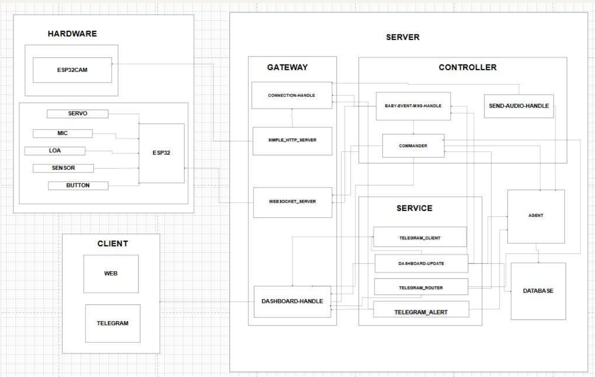
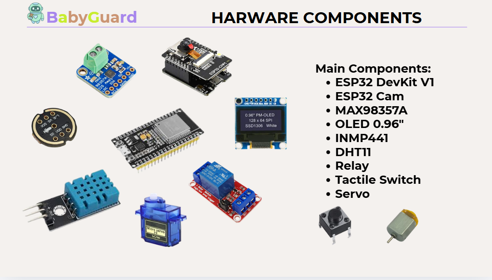
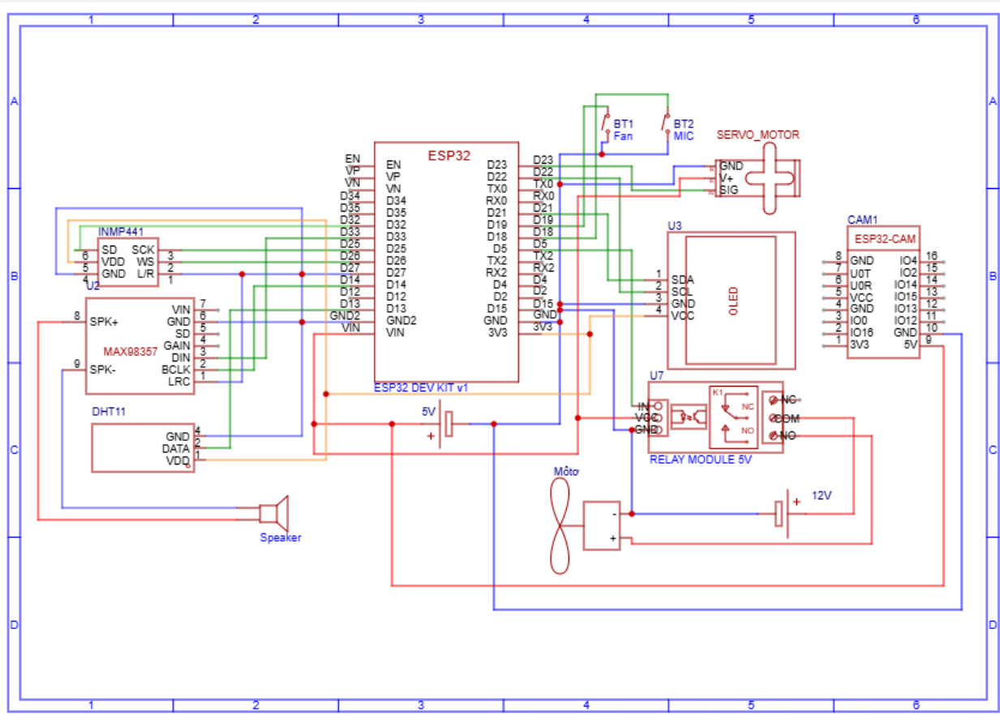

<div align="center">
  
  <br/><br/>
  <p><strong>👶 Hệ thống Giám sát & Chăm sóc Trẻ Sơ sinh Thông minh ứng dụng AI & IoT</strong></p>
  
  [](https://www.python.org)
  [](https://www.espressif.com/)
  [](https://groq.com/)
  [](LICENSE)
  
  <br/>
  🔗 <strong><a href="https://canva.link/sc450phss4c65kh">Link Slide Giới Thiệu (Canva)</a></strong>
</div>

---

## 📖 1. Giới thiệu dự án (Project Overview)
**Baby Cry Detector & Smart Soother** là một giải pháp Life-critical IoT kết hợp giữa Điện toán Biên (Edge AI) và Trí tuệ Nhân tạo Đám mây (Cloud AI) nhằm hỗ trợ các bậc phụ huynh giám sát và chăm sóc trẻ sơ sinh một cách toàn diện.

**Vấn đề giải quyết (Pain Points):**
- Phụ huynh (đặc biệt là người mới có con) thường bị kiệt sức do không thể túc trực 24/7 bên nôi của trẻ.
- Các camera truyền thống chỉ phát hiện cường độ âm thanh (db), không phân biệt được tiếng khóc thật và tiếng ồn môi trường, gây ra vô số báo động giả (False Alarms).
- Camera thông thường không có khả năng phát hiện các tình huống nguy hiểm thầm lặng (như ngạt thở do trẻ bị lật nằm sấp).

**Giải pháp:**
Hệ thống sử dụng cảm biến và mạng nơ-ron để nhận diện chính xác "đặc trưng tiếng khóc", kết hợp Computer Vision để xác minh tư thế ngủ (Pose Detection). Tự động cung cấp cơ chế dỗ dành (Auto-Soother) như phát nhạc, ru võng, đồng thời gửi cảnh báo khẩn cấp qua Telegram với độ trễ cực thấp.

---

## 📸 2. Hình ảnh Sản phẩm (Product Showcase)

<div align="center">
  <!-- Placeholders: Bạn có thể đưa hình ảnh giao diện thực tế vào folder docs/assets/ -->
   
  
  <br/>
  <em>Giao diện Web Dashboard (trái) và Thông báo khẩn cấp qua Telegram Bot (phải)</em>
</div>

---

## ⚙️ 3. Mô tả chi tiết & Tính năng nổi bật (Core Features)

- **Nhận diện Âm thanh Đa nhãn (Audio Classification)**: Tích hợp mô hình **Google YAMNet** (phân loại 521 nhãn sự kiện âm thanh) kết hợp **Silero VAD** giúp bóc tách và phát hiện chính xác "tiếng khóc" giữa các môi trường tạp âm phức tạp (còi xe, tiếng chó sủa).
- **Giám sát An toàn Sinh mạng (Pose Detection)**: Ứng dụng Computer Vision phân tích hình ảnh nôi theo chu kỳ. Kích hoạt báo động mức độ ĐỎ (Critical) nếu phát hiện trẻ bị lật úp mặt (Prone), giúp phòng tránh hội chứng SIDS.
- **Phản hồi Dỗ dành Tự động (Smart Auto-Soother)**: Tự động ra lệnh cho phần cứng kích hoạt cơ cấu ru võng và loa phát nhạc ru. Đi kèm cơ chế *Fail-safe*: Tự động ngắt nhạc sau 5 phút nếu trẻ không nín và nâng mức độ cảnh báo để phụ huynh trực tiếp can thiệp.
- **Trợ lý Ảo Nhi khoa (Conversational AI)**: Tích hợp LLM làm bộ não xử lý ngôn ngữ tự nhiên. Phụ huynh có thể hỏi đáp các kiến thức chăm sóc trẻ thông qua Text hoặc Voice (tích hợp Voice Controller & Wake-word).
- **Cảnh báo Đa kênh (Multi-Channel Alerts)**: Telegram Bot cung cấp cảnh báo đẩy (Push Notifications) kèm hình ảnh hiện trường và các nút bấm điều khiển tức thời (Inline Buttons). Hệ thống đồng thời cung cấp Local Web Dashboard cập nhật trạng thái thời gian thực qua WebSocket.

---

## 🏗 4. Kiến trúc Hệ thống & Nền tảng Công nghệ (Architecture)

<div align="center">
  <!-- Placeholder: Đưa ảnh System Architecture vào docs/assets/system_architecture.png -->
  
  <br/>
  <em>Sơ đồ Kiến trúc Hệ thống (System Architecture) phân chia tầng Hardware, Server, và Client</em>
</div>
<br/>

Dự án được xây dựng dựa trên kiến trúc **Event-Driven Multi-Agent**:

- **Backend Server (Python / aiohttp)**: Máy chủ trung tâm hiệu năng cao, xử lý luồng WebSockets, API `/api/cry`, đồng bộ hóa State và gọi các Plugin/Agent mở rộng.
- **Hardware (ESP32)**:
  - **ESP32 Core**: Vi điều khiển chính xử lý logic cảm biến, động cơ (Servo) và loa.
  - **ESP32-CAM**: Chịu trách nhiệm chụp ảnh và truyền luồng video (Stream/MJPEG).
- **AI Models & Nền tảng Dịch vụ**:
  - **Google YAMNet / FunASR**: Xử lý và phân loại tín hiệu âm thanh kỹ thuật số.
  - **Groq API (Llama 3)**: LLM xử lý ngôn ngữ tự nhiên với tốc độ (Low Latency) cực cao.
  - **Google Gemini API**: Phân tích thị giác (Computer Vision / Pose Detection).

---

## 🚀 5. Hướng dẫn Cài đặt & Triển khai (Installation Guide)

### 5.1 Danh sách Phần cứng cần chuẩn bị (Hardware Requirements)

<div align="center">
  <!-- Placeholder: Đưa ảnh các linh kiện vào docs/assets/hardware_components.png -->
  
</div>
<br/>

Để triển khai thực tế toàn bộ hệ thống, bạn cần chuẩn bị các linh kiện chính (Main Components) sau:
- **ESP32 DevKit V1**: Vi điều khiển trung tâm (Đóng vai trò Edge/Gateway).
- **ESP32 Cam**: Module Camera xử lý luồng stream video/hình ảnh.
- **MAX98357A & Loa (Speaker)**: Module amply I2S khuếch đại âm thanh để phát nhạc ru.
- **OLED 0.96"**: Màn hình hiển thị trạng thái hệ thống cục bộ.
- **INMP441**: Microphone I2S đa hướng thu tín hiệu âm thanh (tiếng khóc) gửi lên Server.
- **DHT11**: Cảm biến đo nhiệt độ và độ ẩm phòng.
- **Relay Module 5V & Motor**: Rơ-le điều khiển đóng ngắt động cơ rung hoặc quạt.
- **Tactile Switch**: Nút nhấn vật lý (Button) để tương tác tại chỗ.
- **Servo (Micro Servo SG90)**: Điều khiển cơ cấu ru võng/nôi tự động.

### 5.2 Sơ đồ Kết nối Phần cứng (Wiring Diagram)
<div align="center">
  <!-- Placeholder: Đưa ảnh sơ đồ đấu dây thực tế (Fritzing/Proteus) vào docs/assets/wiring_diagram.png -->
  
  <br/>
  <em>Sơ đồ chân đấu nối (Wiring Diagram) giữa ESP32, Module Camera, Microphone, Servo và Cảm biến</em>
</div>

### 5.3 Yêu cầu Phần mềm (Software Prerequisites)
- **Software**: Python 3.10+, FFmpeg (để xử lý luồng âm thanh), Arduino IDE (để nạp firmware cho ESP).

### 5.4 Thiết lập Phần cứng (Hardware Setup)
1. Mở thư mục `hardware/esp32`.
2. Dùng **Arduino IDE** để mở 2 sketch: `baby_care_esp32/baby_care_esp32.ino` (mạch điều khiển) và `baby_care_stream_cam/baby_care_stream_cam.ino` (mạch camera).
3. Đổi các tham số cấu hình mạng lưới: `WIFI_SSID`, `WIFI_PASSWORD` và `SERVER_IP` (trỏ về IP tĩnh của máy chủ Backend).
4. Nạp code (Compile & Upload) xuống các mạch ESP32 tương ứng.

### 5.5 Thiết lập Backend Server (Software Setup)
1. Clone repository và đi tới thư mục `server`:
   ```bash
   git clone https://github.com/username/IOT_quanlytreem.git
   cd IOT_quanlytreem/server
   ```
2. Cài đặt các thư viện Python:
   ```bash
   pip install -r requirements.txt
   ```
3. Cấu hình biến môi trường (Secrets Management):
   > ⚠️ **CẢNH BÁO BẢO MẬT (Security Risk)**: Đảm bảo rằng file cấu hình đã được khai báo trong `.gitignore`. Tuyệt đối không push (đẩy) API Key của bạn lên GitHub để tránh bị đánh cắp tài khoản.
   - Tạo file ẩn `server/data/.config.yaml` để ghi đè cấu hình bảo mật.
   - Bổ sung các API Keys bắt buộc:
     ```yaml
     telegram:
       bot_token: "YOUR_TELEGRAM_BOT_TOKEN"
       chat_id: "YOUR_CHAT_ID"
     LLM:
       GroqLLM:
         api_key: "YOUR_GROQ_API_KEY"
       GeminiLLM:
         api_key: "YOUR_GEMINI_API_KEY"
     ```
4. Khởi chạy Server:
   - **Chạy trực tiếp (Local)**: Chạy lệnh `python app.py` (Hoặc có thể sử dụng shell script: `run_server.bat` cho Windows và `./run_server.sh` cho macOS/Linux).
   - **Chạy qua Docker**: Chạy lệnh `docker compose up --build`.

### 5.6 Giám sát Hệ thống
- Giao diện **Web Dashboard** được tự động khởi chạy tại: `http://localhost:8003/`
- Mở Telegram, truy cập Bot của bạn và gửi lệnh `/start` để kết nối.

---

<div align="center">
  <p>Được phát triển với ❤️ dành cho sự an toàn và sức khỏe của trẻ em.</p>
</div>
